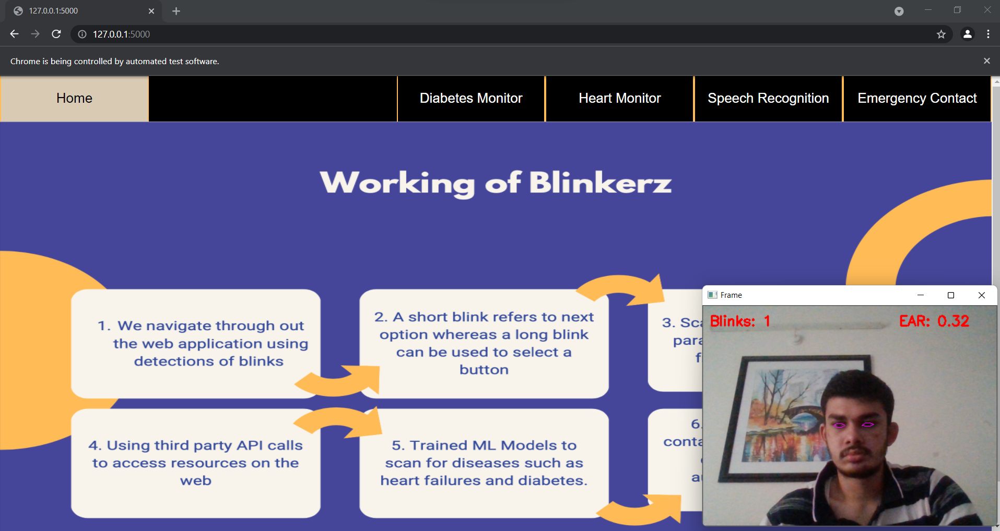
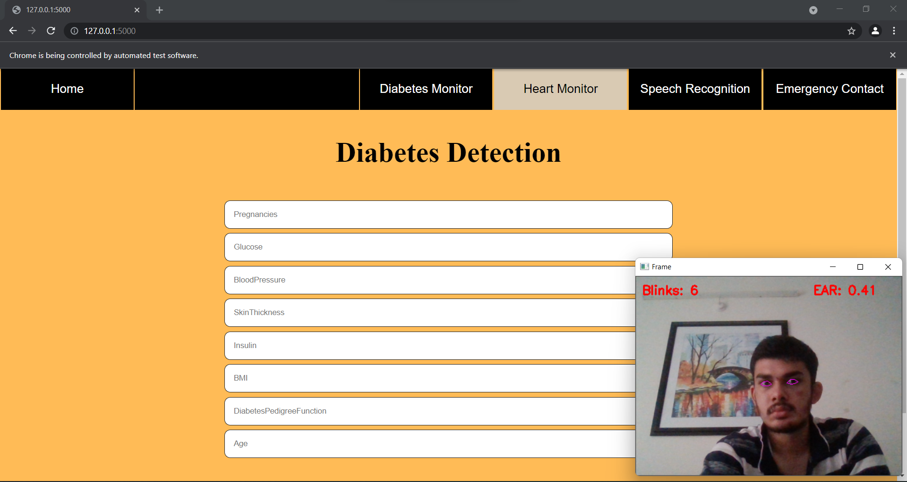
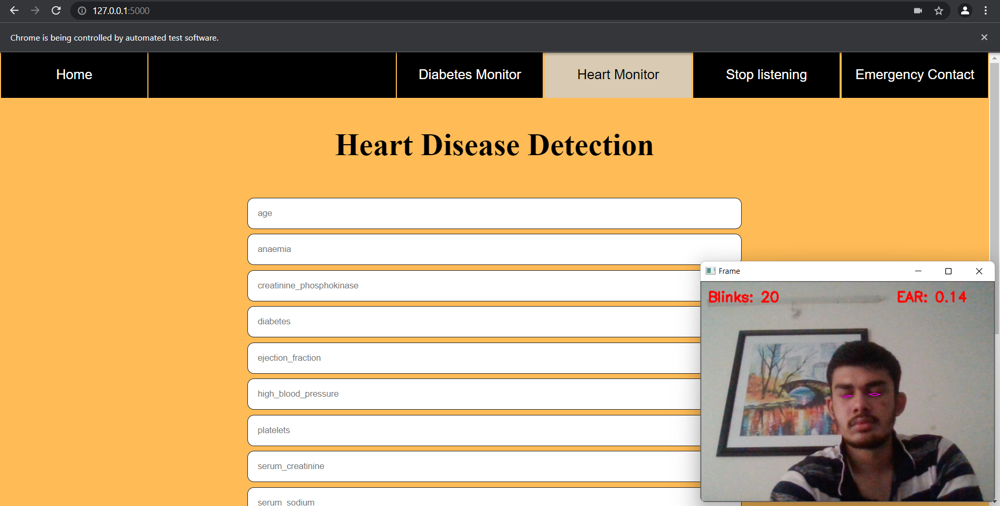
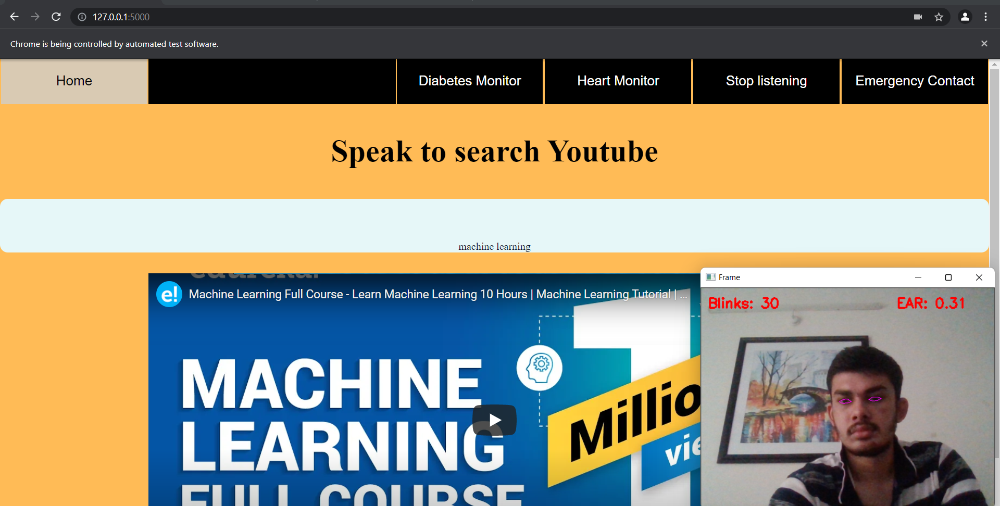
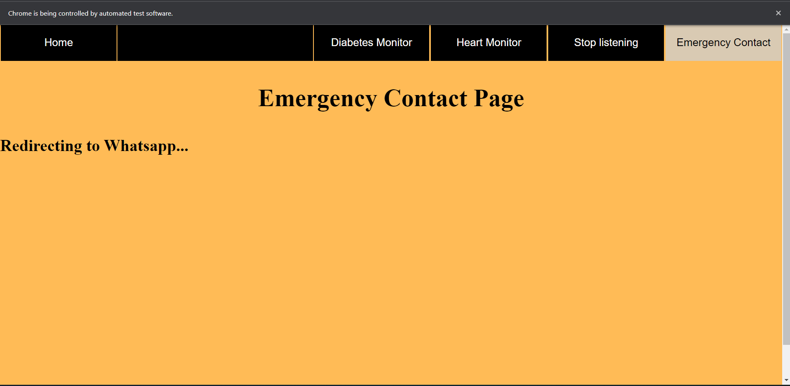

#  DevJams'21 - Blinkers
Public Repo For DevJams'21

#  Blinkerz
## Track: Digital Accessibility
Project Presented by TEAM : Blinkers


# Our Team
Member | Registration No
------------- | -------------
Subiksha Jegadish | (20BCE0439)
Sowmiyalakshmi G | (20BCE2137)
Arhit Bose Tagore | (20BCE2150) 


##  Overview of the Project

>One stop solution for all accessing the internet at the blink of an eye. Simple Web App with an automation software to cater needs of education, entertainment, and health.

##  Significance of the Project

* Integrates a fully functional one stop
destination for the one's who are physically
handicapped or unable to access web

* Revolutionize the means of
accessing the world wide web at their own
convenience

* Bring together
emergency and health features to cater one's
needs.


### Prerequisites

- Python 3.8.10 and the latest version of pip.
  
## Install the App:

1. Fork it.

2. Clone the repo
   ```sh
   git clone https://github.com/CaptAlpha/DevJams-21-HackRepo.git
   ```
3. Install `requirements.txt`
   ```sh
   pip install -r requirements.txt
   ```
4. Run `blinkerz.py`
   ```
    cd Blink-Detection-Module
    python blinkerz.py

5. Configure CMakelist.txt
   ```
   cd Blink-Detection-Module
   cmake CMakeLists.txt
   make
   ./Blink-Detection-Module
   ```
6. Run `app.py`
   ```
   cd Blink-Detection-Module
   python app.py
   ```
7. Open `localhost:5000` in your browser.

   ```

## Instructions: 
1. Short Blink to move to next tab 
2. Long Blink to click on the tab


##  Our Project:







